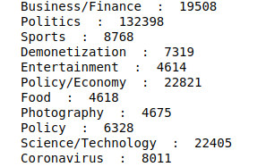
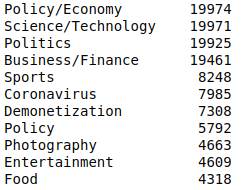
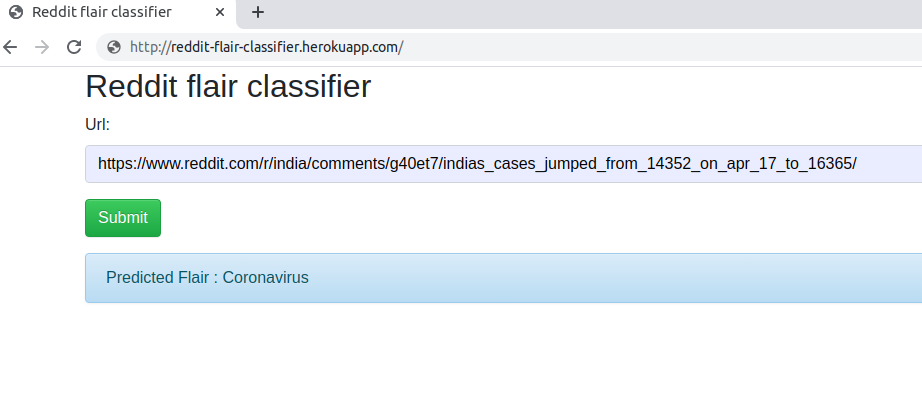

# Reddit Flair detector

MIDAS Assignment

## Data Acquisition

Used the [pushshift](https://pushshift.io/) API to scrape posts and submissions from Reddit. This API had a much larger dataset available than the rate limited official Reddit API as well as PRAW. The posts are taken from 4 different times over the last 5 years to have a good mix of flairs. As pushshift returns at max 1000 posts in a single request, posts time stamps are used to avoid repeated posts. Raw pushshift data dump can be found [here](https://drive.google.com/file/d/1uRjj-v0AXgGQpKlM3swt5FzQrugcUD12/view?usp=sharing).

The submission body text is cleaned by removing punctuation marks, removing extra white spaces and then converting the whole text to lower case. Also unidentified tokens like Hindi Font words are also removed.

All flairs with less than 2000 submissions have been removed for a better view and ambiguous flairs like ```Non-political``` , ```Scheduled``` , ```Repost``` etc were removed. Same flairs with different names were merged together.

Selected flairs with flair count :- 



Further to avoid inter-class imbalance due to the large differences in training instances of various classes, i have limited the amount of submissions upto 20,000 for each class.

Final Flair Count :- 



The final csv file can be downloaded from [here](https://drive.google.com/file/d/1U2sAbiCkxNsj4JwX1d2A1u9Ty8eK_oJ3/view?usp=sharing).


## Models

To classify a flair I have used both the title and body of the post. If the body of the flair is not present (it is an image, is a URL or written Hindi), then only the title is used. First i trained a language model on the data. Then used this trained language model as the encoder for the classifier and fine-tuned them together.

Link to the model :-  https://drive.google.com/file/d/1-1ONGZa231gH9jDMJY3doNnrc_POHrEa/view?usp=sharing

### Result

Achieved about ```78% ``` accuracy considering both the title and body (if present) of the reddit flair.


### Deployment

The classifier has been deployed to heroku. Link :- http://reddit-flair-classifier.herokuapp.com/



For automated testing use http://reddit-flair-classifier.herokuapp.com/automated_testing.

Make a POST request to this url with a file that contains reddit post url in each line and returns the predicted flairs in json format.

```
curl -X POST -F 'upload_file=@/path/to/file' http://reddit-flair-classifier.herokuapp.com/automated_testing
```

To save the response to a file use this

```
curl -X POST -F 'upload_file=@/path/to/file' http://reddit-flair-classifier.herokuapp.com/automated_testing >> response_file
```

